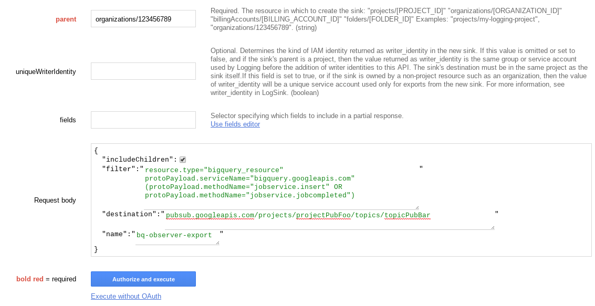
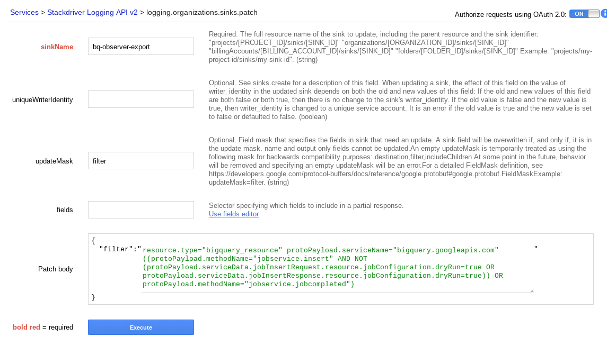

# Organization Wide Stackdriver Log Export

This will be an example of setting up an organization wide audit log export for BigQuery Query entries. Initially we will create a filter for Query jobs, and export to PubSub or BigQuery. It should be noted, however, that the audit log export could be used to export any audit log filter, not just BigQuery Queries.

The usual way of creating a Stackdriver Log Export involves using the Google Cloud Console interface which can only be reached per-project. This will provide an example of using the Aggregated Logs for the Org-Wide export.

## Extra Documentation

* [Cloud Audit Logging Docs](https://cloud.google.com/logging/docs/audit/)
* [Stackdriver Logs Export Overview](https://cloud.google.com/logging/docs/export/)
* [Stackdriver Logs Export by Project](https://cloud.google.com/logging/docs/export/configure_export_v2)
* [Stackdriver Logs Export - Aggregated Exports](https://cloud.google.com/logging/docs/export/aggregated_exports)

_Caution (From the Aggregated Export Docs above): If you enable this feature, your aggregated export sink might export a very large number of log entries. To avoid exporting too many log entries, design your aggregated export sink filter carefully, as described on this page. For details on potential costs, see Stackdriver Pricing._


## Prerequisites 

### Permissions
* To create or modify a sink, you must have the IAM roles Owner or Logging/Logs Configuration Writer in the sink's parent resource. [Click here for more information](https://cloud.google.com/logging/docs/export/#sink-terms).
* For security, when you create the export sink, it creates a unique service account which is used to grant it permissions to write out the logs to BQ, PubSub or GCS.

### Information

* OrgID - You'll need to use your OrgID, [here is how you can get that](https://cloud.google.com/resource-manager/docs/creating-managing-organization#retrieving_your_organization_id).
    * Our OrgID for this doc will be ```123456789```.
* (Optional for PubSub) ProjectID and Topic (should be created already)
* (Optional for BigQuery Export) ProjectID and DatasetID (should be created already)

## Start with a filter
In this case we'll use the console to build the filter for the items we'd like to export

    resource.type="bigquery_resource"
    protoPayload.serviceName="bigquery.googleapis.com"
    (protoPayload.methodName="jobservice.insert" OR protoPayload.methodName="jobservice.jobcompleted")


## Create the Org Wide Sink

#### First, go to Google's APIs Explorer

* [https://developers.google.com/apis-explorer/#p/logging/v2/logging.organizations.sinks.create](https://developers.google.com/apis-explorer/#p/logging/v2/logging.organizations.sinks.create)

#### Fill out Form



* ```parent``` as ```orgainizations/[ORGANIZATION_ID]```
* You can leave ```uniqueWriterIdentity``` empty
* you can leave ```fields``` empty
* In ``Request body```
    * select ```add a property``` and then ```includeChildren```, then check it
    * select ```add a property``` and then ```name```, and then name it
        * this is just the name of the sink itself
    * select ```add a property``` and then ```destination```
        * for PubSub, fill in: ```pubsub.googleapis.com/projects/[PROJECT_ID]/topics/[TOPIC_ID]``` 
        * for BigQuery, fill in ```bigquery.googleapis.com/projects/[PROJECT_ID]/datasets/[DATASET_ID]```
        * for GCS, fill in ```storage.googleapis.com/[BUCKET_ID]```
   
#### Submit form and record new writer identity

When you submit the form, you should get a 200, and in the response there should be a ```writerIdentity``` like ```[GENERATED_ID_1]@[GENERATED_ID_2].iam.gserviceaccount.com```.

This identity will need to be granted access to the resource in the ```destination``` field above.

Please follow the following documentation to grant the appropriate authorization for the service account in ```writerIdentity``` to the ```destination```.
* [https://cloud.google.com/logging/docs/export/configure_export_v2#dest-auth](https://cloud.google.com/logging/docs/export/configure_export_v2#dest-auth)

# Update Filter (if needed)

Should you need to change the filter, you can 'patch' the filter using the APIs Explorer as well

#### Prereqs

* Sink name
    * If you need to find your name, you can list them by entering your ```organizations/[ORGANIZATION_ID]``` as ```parent``` here:
        * [https://developers.google.com/apis-explorer/#p/logging/v2/logging.organizations.sinks.list](https://developers.google.com/apis-explorer/#p/logging/v2/logging.organizations.sinks.list)

#### APIs Explorer

Navigate to:
* [https://developers.google.com/apis-explorer/#p/logging/v2/logging.organizations.sinks.patch](https://developers.google.com/apis-explorer/#p/logging/v2/logging.organizations.sinks.patch)

#### Fill out form

* Enter your sink name in ```sinkName```
* Leave ```uniqueWriterIdentity``` blank
* Enter ```filter``` in ```updateMask```
* In the ```Patch body```:
    * select ```add a property``` then ```filter```, and add the complete updated filter you want to use to replace the filter currently in the sink.



When you execute, you should get a 200 response and the resulting Sink JSON with the updated filter.