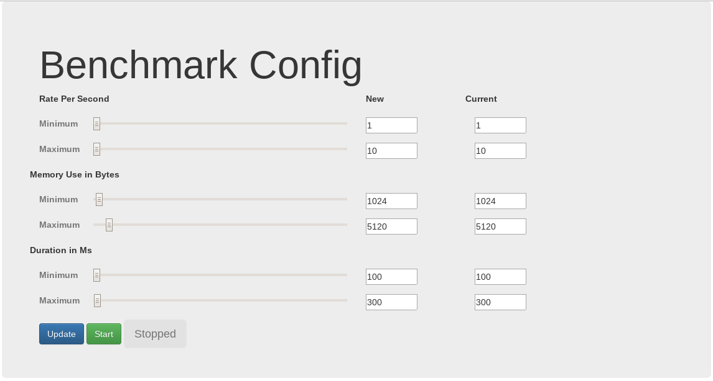

# PubSub GAE Benchmark Example App

This is an example of a golang stanadard GAE App, with a UI that configures a load-generation producer which publishes payloads to PubSub to simulate a data pipeline.

This shows how to configure a more complicated setup with the modern Golang standard (BETA) version, while also using the libraries necessary to use the local dev_appserver (for taskqueue, pubsub, etc).

The UI has the variable settings, and start/stop for the producer to tell the consumer to use X bytes of memory, and take X milliseconds.

## Diagram

    +---------------------+             "/"                 +---------------+
    |                     <---------------------------------+               |
    |  Web UI             |                                 |   UI Service  |
    |                     |        Update/Start/Stop        |               |
    |  Config             +--------------------------------->               |
    |                     |                                 |               |
    |  Start/Stop         |         +--------------+        +-+------+------+
    |                     |         |              |          |      |       
    |                     |         |    Config    <----------+      |       
    |                     |         |  (Memcache)  |                 |       
    |                     |         |              |        +--------v------+
    |                     |         |              +-------->               |
    |                     |         +--------------+        |   Producer    |
    |                     |                                 |               |
    |                     |              +------------------+               |
    |                     |              | +----------------+               |
    +---------------------+              | |                +---------------+
                                         | |                                 
                               +---------v-v------------+                    
                               |                        |                    
                               |      PubSub Topic      |                    
                               |                        |                    
                               +-----+--+--+--+--+------+                    
                                     |  |  |  |  |                           
                                     v  v  v  v  v                           
                                                                             
                             +-------------------+                           
                             |  +-------------------+                        
                             |  |  +-------------------+                     
                             |  |  |  +------------------+                   
                             |  |  |  |                  |                   
                             |  |  |  |    Consumer      |                   
                             |  |  |  |    (default)     |                   
                             |  |  |  |                  |                   
                             +--+  |  |                  |                   
                                +--+  |                  |                   
                                   +--+                  |                   
                                      +------------------+                   

## Current Status

Each piece above is working, which makes this a useable/useful skeleton project to use as boilerplate for any similar type of Golang AppEngine service.

#### Ideas for further investigation

* How does GAE behave in golang standard as the memory footprint of each request increases?
* How do we overcome the 1000 outstanding messages limit of pubsub when it takes longer to ACK the messages? (TaskQueue vs Topic Sharding vs Pull)
* What is the cost/performance/trade-off comparison of this type of setup compared to similar one in k8s?

#### TODO

* Add example Stackdriver dashboard configurations
* Add tests, use dev_appserver.py in tests
* Add OpenCensus metric collection for better Consumer observability
* Deploy using Terraform/CI/CD pipeline
